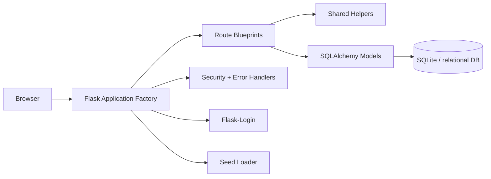
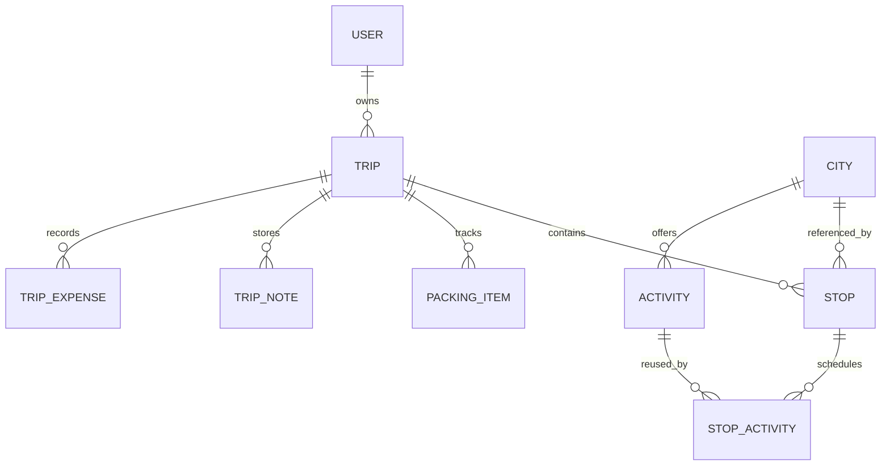

# Traveloop

Travel planning platform for creating trips, building itineraries, tracking packing, managing budgets, and sharing public trip links.

## Repository Structure

This repository is organized so GitHub shows a clear split between backend logic, frontend assets, and supporting project files.

```text
.
├── backend/            # Flask application, models, routes, helpers, security
├── frontend/           # UI assets and templates/static files
├── Database/           # Local database artifacts during development
├── run.py              # Root-level Flask entrypoint
├── requirements.txt    # Root-level Python dependency list
├── readme.md           # Project documentation
├── .env.example        # Environment template for GitHub
└── .gitignore          # Repository ignore rules
```

File placement rules:

- `requirements.txt` stays at the repository root so one install command covers the whole project.
- `run.py` stays at the repository root as the top-level entrypoint for local execution.
- `backend/` should contain the Flask package only, not the dependency manifest or root launcher.

What should be committed to GitHub:

- Source code in `backend/` and `frontend/`
- Dependency files like `requirements.txt` and `frontend/package.json`
- Documentation and workflow notes
- Environment templates such as `.env.example`
- Ignore rules and any non-secret config scaffolding
- Local workflow notes should remain untracked and stay out of GitHub

What should not be committed:

- Real `.env` files
- SQLite database files
- Generated uploads
- Virtual environments
- Build output and cache folders

## 1. Problem Statement

Travel planning usually gets scattered across notes, messages, maps, spreadsheets, and reminders. Traveloop consolidates that workflow into one server-rendered web app so a traveler can plan, organize, and review an entire trip in one place.

Inputs:

- Traveler account details
- Trip metadata such as name, dates, and description
- Stops, activities, notes, packing items, and manual expenses
- Optional shared link access for public viewing

Outputs:

- Structured trip plans
- Day-by-day itinerary data
- Budget breakdowns
- Packing progress
- Shareable public trip pages

Core entities:

- User
- Trip
- City
- Activity
- Stop
- StopActivity
- PackingItem
- TripNote
- TripExpense

## 2. Features

MVP features implemented in the backend:

- Session-based authentication with signup, login, and logout
- Trip CRUD with ownership checks
- Itinerary builder with stops and scheduled activities
- Budget tracking with manual expenses and activity-based cost summaries
- Packing checklist with completion toggles
- Trip notes and journaling
- Public share links with token-based access
- Profile management for name, email, password, and account deletion

Operational features now added for hardening:

- Environment-aware config selection
- Controlled database bootstrap and seed behavior
- Security headers on every response
- Open redirect protection on login
- Centralized error responses for browser and JSON clients
- Shared backend helpers for safer request parsing and ownership lookups

## 3. Tech Stack

- Flask: lightweight web framework with a clean application factory pattern.
- Flask-SQLAlchemy: ORM for relational data modeling and ownership-aware queries.
- Flask-Login: session management for authenticated travelers.
- Flask-WTF: dependency already present for future CSRF/form hardening.
- SQLite: local development database with zero infrastructure overhead.
- Werkzeug security utilities: password hashing and safe filename handling.

Why this stack:

- It keeps deployment simple.
- It avoids external services for core storage.
- It maps naturally to a relational travel-planning domain.
- It supports a server-rendered app without introducing a heavier frontend stack.

Alternatives rejected for this scope:

- JWT auth: unnecessary for a server-rendered session app.
- External DB services: more operational overhead than needed for the current phase.
- Full SPA architecture: would add complexity without improving the core workflow here.

## 4. Architecture (HLD)

The app uses a layered Flask architecture:



Component breakdown:

- `backend/app.py` builds the app, loads config, registers blueprints, and installs hardening hooks.
- `backend/config.py` owns environment-specific configuration.
- `backend/routes/` contains feature blueprints.
- `backend/models/` contains persistence models and relationships.
- `backend/helpers.py` contains shared request and ownership logic.
- `backend/security.py` centralizes security headers and error handlers.

Data flow:

1. The browser sends a request to a blueprint route.
2. The route validates ownership and request payloads.
3. The route reads or writes SQLAlchemy models.
4. The response is rendered as HTML or JSON.
5. Security headers and error handlers apply automatically.

Trade-offs:

- Server-rendered views are simpler to maintain, but less interactive than a SPA.
- SQLite is efficient for local development, but a multi-user production deployment should move to PostgreSQL or another robust server database.
- Shared helpers reduce duplication, but they should stay small and explicit to avoid hiding business rules.

## 5. Database Design

High-level ER model:



Table summary:

- `users`: authentication identity, profile data, and role flags.
- `trips`: trip metadata, dates, public share state, and cover image path.
- `cities`: curated destination catalog seeded from local JSON.
- `activities`: city-specific activity catalog with cost and duration metadata.
- `stops`: ordered trip destinations linked to a city.
- `stop_activities`: scheduled activities for a stop and day.
- `packing_items`: checklist entries tied to a trip.
- `trip_notes`: free-form trip journal entries.
- `trip_expenses`: manual budget items.

Indexing strategy:

- Primary ownership columns like `user_id`, `trip_id`, `city_id`, and `stop_id` are indexed where query patterns depend on them.
- `email` is indexed and unique for fast login and duplicate prevention.
- `share_token` is indexed to support public lookup.

Known limitations:

- SQLite is fine for demos and early growth, but production should use a server database with better concurrency.
- Cost and duration are currently represented with simple numeric fields rather than a more detailed pricing model.

## 6. API Documentation

Main endpoints:

| Method | Path | Purpose |
|---|---|---|
| GET/POST | `/login` | Authenticate a traveler |
| GET/POST | `/signup` | Create a new account |
| GET | `/logout` | End the current session |
| GET | `/dashboard` | Show overview after login |
| GET/POST | `/trips/create` | Create a trip |
| GET | `/trips/` | List trips |
| GET | `/trips/<trip_id>` | View trip details |
| GET/POST | `/trips/<trip_id>/edit` | Update trip metadata |
| POST | `/trips/<trip_id>/delete` | Delete a trip |
| GET | `/itinerary/<trip_id>/builder` | Open itinerary builder |
| POST | `/itinerary/<trip_id>/add-stop` | Add a stop |
| POST | `/itinerary/<trip_id>/reorder-stops` | Update stop order |
| POST | `/itinerary/stop/<stop_id>/add-activity` | Schedule an activity |
| POST | `/budget/<trip_id>/add-expense` | Add manual expense |
| POST | `/notes/<trip_id>/add` | Add a note |
| POST | `/packing/<trip_id>/add` | Add a packing item |
| POST | `/share/trip/<trip_id>/generate` | Generate a public link |
| GET | `/share/<token>` | View a shared trip |

Request/response behavior:

- HTML routes render templates.
- AJAX-friendly routes return JSON when the request is JSON.
- Error handling returns consistent codes and messages.

Edge cases handled:

- Invalid ownership returns 404 instead of leaking records.
- Invalid dates return friendly validation errors.
- Empty or missing required fields are rejected server-side.
- Login redirect targets are checked for same-host safety.

## 7. UI/UX Decisions

The backend is structured for a server-rendered experience with distinct pages for each task domain:

- Dashboard for the summary view
- Trips for trip CRUD
- Itinerary for planning stops and activities
- Budget for cost tracking
- Packing for checklist management
- Notes for journaling
- Profile for account management
- Share view for public trip access

Layout reasoning:

- Each feature is isolated so users can work step by step.
- The itinerary builder is the primary workspace because trip planning is the highest-frequency task.
- Budget, packing, and notes sit adjacent to the trip because they are all trip-scoped workflows.

The current workspace snapshot does not include HTML template files, so the UI is documented from the route structure and rendering intent rather than from concrete template implementations.

## 8. Security

Security mechanism:

- Session-based authentication with Flask-Login
- Password hashing via Werkzeug
- Ownership checks on trip-scoped routes
- Public sharing via unguessable random tokens
- Security headers on every response
- Open redirect filtering on login
- Centralized error handling to avoid leaking internal details

Validation approach:

- Required fields are checked server-side.
- Dates are parsed as ISO values only.
- Numeric identifiers are validated before use.
- Trip ownership is enforced before mutation.

Vulnerabilities prevented:

- Horizontal privilege escalation
- Open redirect abuse
- Password disclosure
- Accidental GET-based destructive actions
- Unbounded file uploads via configured size limits

## 9. Scalability

Current capacity:

- Good for local development, demos, and small team usage.
- The current relational model is efficient for trip-scoped reads and writes.

Growth strategy:

- Move from SQLite to PostgreSQL for production concurrency.
- Add pagination on large list views.
- Introduce caching for read-heavy catalog pages such as cities and activities.
- Extract long-running work like analytics or notifications into background jobs if needed.

Caching possibilities:

- Popular destinations list
- Seeded city catalog
- Public share page metadata

Trade-offs:

- Keeping the app server-rendered simplifies operations, but some highly interactive flows would benefit from background processing later.
- Dynamic relationships keep the code readable, but very large datasets may need pagination or projection queries.

## 10. Logging & Debugging

Logging strategy:

- The app configures a structured logger in the factory.
- Log level can be controlled with `LOG_LEVEL`.
- Unhandled server errors are logged centrally.

Error handling approach:

- `400`, `403`, `404`, `413`, and `500` all have explicit handlers.
- JSON requests receive JSON errors.
- Browser requests receive simple status-text responses instead of raw tracebacks.

How to trace issues:

- Check the app logs for the route and error type.
- Reproduce the request with the same ownership and payload shape.
- Verify the relevant helper function or ownership query.

## 11. Setup & Installation

Prerequisites:

- Python 3.10+ recommended
- A virtual environment
- Local access to SQLite file storage

Step-by-step setup:

1. Create and activate a Python environment.
2. Install dependencies from `requirements.txt`.
3. Set `APP_ENV=development` for local work.
4. Set `AUTO_CREATE_DB=1` and `AUTO_SEED_DATA=1` for first-run local setup.
5. Set `SECRET_KEY` before any production-style deployment.
6. Run `python run.py`.

Environment variables:

- `APP_ENV`: `development`, `production`, or `testing`
- `DATABASE_URL`: override the default SQLite path
- `SECRET_KEY`: required for secure sessions
- `FLASK_DEBUG`: enable only for local debugging
- `PORT`: application port for local or deployed execution
- `LOG_LEVEL`: controls backend verbosity
- `AUTO_CREATE_DB`: allow `db.create_all()` at startup
- `AUTO_SEED_DATA`: allow seed loading at startup

Run modes:

- Local demo: development env with auto-create and auto-seed enabled.
- Production: production env with secure cookies, real DB URL, and startup automation disabled.

## 12. Design Decisions

Major reasons behind the current structure:

- Factory pattern keeps the app testable and environment-aware.
- Blueprints keep domains isolated and easier to maintain.
- Shared helpers reduce repeated authorization and parsing logic.
- Local seed data keeps the app self-contained and demo-friendly.
- Random share tokens are safer than predictable public IDs.
- Security headers and error handlers raise the baseline without adding heavy infrastructure.

Trade-offs accepted:

- Simplicity over a complex microservice architecture.
- Relational storage over document storage because the domain is inherently relational.
- Server-rendered pages over a full SPA because the app is workflow-focused.

What would change at scale:

- Switch to PostgreSQL.
- Add proper CSRF enforcement to every form once templates are confirmed.
- Add pagination and filtering on all large collections.
- Add background jobs for notifications or export tasks.
- Add test coverage around auth, ownership checks, and public sharing.

## Team

- Ashutosh Singh
- Manav Barot
- Kotak Naman

## Mentor

- Aditi Patel ([GitHub](https://github.com/adip-odoo))