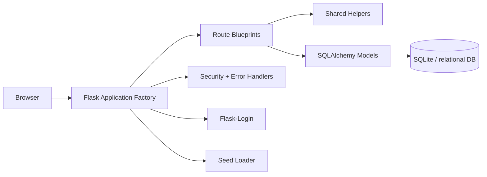
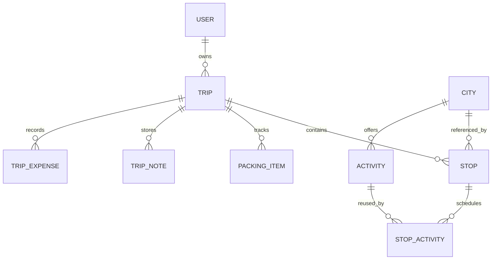

# Traveloop

Traveloop is a judge-ready travel planning platform for creating trips, building itineraries, tracking packing, managing budgets, and sharing public trip links.

## Hackathon Summary

Traveloop turns trip planning into one organized workflow instead of scattered notes, chats, spreadsheets, and reminders. The app lets a traveler create a trip, plan stops and activities, track packing and spending, and share the final itinerary with others through a public link.

What makes this submission strong:

- A complete trip-planning workflow from account creation to sharing
- A production-aware Flask backend with safer defaults and centralized helpers
- Ownership checks across user-scoped data so travelers only see their own content
- Security hardening for redirects, cookies, error handling, and request parsing
- Clear product and system design that can scale beyond a hackathon demo

## Project Layout

The codebase is organized for clarity, not for hiding implementation details.

```text
.
├── backend/            # Flask app, models, routes, helpers, security, config
├── frontend/           # UI assets, templates, and static files
├── Database/           # Local development database artifacts
├── run.py              # Root-level Flask entrypoint
├── requirements.txt    # Root-level Python dependency list
└── readme.md           # Project documentation and design notes
```

## 1. Problem Statement

Travel planning usually gets scattered across notes, messages, maps, spreadsheets, and reminders. Traveloop consolidates that workflow into one server-rendered web app so a traveler can plan, organize, and review an entire trip in one place.

The product goal is simple: reduce planning friction while keeping the experience understandable, secure, and easy to demo.

Inputs:

- Traveler account details
- Trip metadata such as name, dates, and description
- Stops, activities, notes, packing items, and manual expenses
- Optional shared link access for public viewing

Outputs:

- Structured trip plans
- Day-by-day itinerary data
- Budget breakdowns
- Packing progress
- Shareable public trip pages

Core entities:

- User
- Trip
- City
- Activity
- Stop
- StopActivity
- PackingItem
- TripNote
- TripExpense

## 2. Key Features

Traveloop covers the core travel-planning journey end to end:

- Session-based authentication with signup, login, and logout
- Trip creation, editing, and deletion with ownership checks
- Itinerary building with stops and scheduled activities
- Budget tracking with manual expenses and trip-wide cost summaries
- Packing checklist management with completion toggles
- Trip notes and journaling for day-by-day planning
- Public share links for read-only trip access
- Profile management for account updates and password changes

Operational hardening included in the backend:

- Environment-aware config selection
- Controlled database bootstrap and seed behavior
- Security headers on every response
- Open redirect protection on login
- Centralized error responses for browser and JSON clients
- Shared backend helpers for safer request parsing and ownership lookups

## 3. Tech Stack

- Flask: lightweight web framework with a clean application factory pattern.
- Flask-SQLAlchemy: ORM for relational data modeling and ownership-aware queries.
- Flask-Login: session management for authenticated travelers.
- Flask-WTF: dependency already present for future CSRF/form hardening.
- SQLite: local development database with zero infrastructure overhead.
- Werkzeug security utilities: password hashing and safe filename handling.

Why this stack:

- It keeps deployment simple.
- It avoids external services for core storage.
- It maps naturally to a relational travel-planning domain.
- It supports a server-rendered app without introducing a heavier frontend stack.

## 4. Submission Value

This project is built to demonstrate more than basic CRUD.

- It shows a complete domain workflow with real user value.
- It demonstrates backend structure that is maintainable under production constraints.
- It includes explicit security decisions rather than assuming the demo environment is safe.
- It documents the product and the system clearly enough for reviewers to evaluate the implementation.

## 5. Architecture (HLD)

The app uses a layered Flask architecture:



Component breakdown:

- `backend/app.py` builds the app, loads config, registers blueprints, and installs hardening hooks.
- `backend/config.py` owns environment-specific configuration.
- `backend/routes/` contains feature blueprints.
- `backend/models/` contains persistence models and relationships.
- `backend/helpers.py` contains shared request and ownership logic.
- `backend/security.py` centralizes security headers and error handlers.

Data flow:

1. The browser sends a request to a blueprint route.
2. The route validates ownership and request payloads.
3. The route reads or writes SQLAlchemy models.
4. The response is rendered as HTML or JSON.
5. Security headers and error handlers apply automatically.

Design principles:

- Server-rendered views keep the app approachable for users and reviewers.
- Relational data modeling matches the ownership-heavy trip workflow.
- Shared helpers keep route code concise and consistent.

## 6. Database Design

High-level ER model:



Table summary:

- `users`: authentication identity, profile data, and role flags.
- `trips`: trip metadata, dates, public share state, and cover image path.
- `cities`: curated destination catalog seeded from local JSON.
- `activities`: city-specific activity catalog with cost and duration metadata.
- `stops`: ordered trip destinations linked to a city.
- `stop_activities`: scheduled activities for a stop and day.
- `packing_items`: checklist entries tied to a trip.
- `trip_notes`: free-form trip journal entries.
- `trip_expenses`: manual budget items.

Indexing strategy:

- Primary ownership columns like `user_id`, `trip_id`, `city_id`, and `stop_id` are indexed where query patterns depend on them.
- `email` is indexed and unique for fast login and duplicate prevention.
- `share_token` is indexed to support public lookup.

Known limitations:

- SQLite is fine for demos and early growth, but production should use a server database with better concurrency.
- Cost and duration are currently represented with simple numeric fields rather than a more detailed pricing model.

## 7. API Documentation

Main endpoints:

| Method | Path | Purpose |
|---|---|---|
| GET/POST | `/login` | Authenticate a traveler |
| GET/POST | `/signup` | Create a new account |
| GET | `/logout` | End the current session |
| GET | `/dashboard` | Show overview after login |
| GET/POST | `/trips/create` | Create a trip |
| GET | `/trips/` | List trips |
| GET | `/trips/<trip_id>` | View trip details |
| GET/POST | `/trips/<trip_id>/edit` | Update trip metadata |
| POST | `/trips/<trip_id>/delete` | Delete a trip |
| GET | `/itinerary/<trip_id>/builder` | Open itinerary builder |
| POST | `/itinerary/<trip_id>/add-stop` | Add a stop |
| POST | `/itinerary/<trip_id>/reorder-stops` | Update stop order |
| POST | `/itinerary/stop/<stop_id>/add-activity` | Schedule an activity |
| POST | `/budget/<trip_id>/add-expense` | Add manual expense |
| POST | `/notes/<trip_id>/add` | Add a note |
| POST | `/packing/<trip_id>/add` | Add a packing item |
| POST | `/share/trip/<trip_id>/generate` | Generate a public link |
| GET | `/share/<token>` | View a shared trip |

Request/response behavior:

- HTML routes render templates.
- AJAX-friendly routes return JSON when the request is JSON.
- Error handling returns consistent codes and messages.

Edge cases handled:

- Invalid ownership returns 404 instead of leaking records.
- Invalid dates return friendly validation errors.
- Empty or missing required fields are rejected server-side.
- Login redirect targets are checked for same-host safety.

## 8. UI/UX Decisions

The backend is structured for a server-rendered experience with distinct pages for each task domain:

- Dashboard for the summary view
- Trips for trip CRUD
- Itinerary for planning stops and activities
- Budget for cost tracking
- Packing for checklist management
- Notes for journaling
- Profile for account management
- Share view for public trip access

Layout reasoning:

- Each feature is isolated so users can work step by step.
- The itinerary builder is the primary workspace because trip planning is the highest-frequency task.
- Budget, packing, and notes sit adjacent to the trip because they are all trip-scoped workflows.

The current workspace snapshot does not include HTML template files, so the UI is documented from the route structure and rendering intent rather than from concrete template implementations.

## 9. Security

Security mechanism:

- Session-based authentication with Flask-Login
- Password hashing via Werkzeug
- Ownership checks on trip-scoped routes
- Public sharing via unguessable random tokens
- Security headers on every response
- Open redirect filtering on login
- Centralized error handling to avoid leaking internal details

Validation approach:

- Required fields are checked server-side.
- Dates are parsed as ISO values only.
- Numeric identifiers are validated before use.
- Trip ownership is enforced before mutation.

Vulnerabilities prevented:

- Horizontal privilege escalation
- Open redirect abuse
- Password disclosure
- Accidental GET-based destructive actions
- Unbounded file uploads via configured size limits

## 10. Scalability

Target scale:

- Designed to scale horizontally toward very high concurrency, including a 1-million-user class deployment when backed by proper infrastructure.
- Optimized for trip-scoped reads and writes, where most requests stay small and isolated to a single user or trip.

Production scaling plan:

- Replace SQLite with PostgreSQL or a managed equivalent as the primary transactional datastore.
- Run the Flask app behind a load balancer with multiple stateless application instances.
- Move sessions, rate limiting state, and hot cache data into Redis or an equivalent distributed cache.
- Use background workers for notifications, exports, image processing, reminders, and any non-request work.
- Add read replicas for catalog-heavy or analytics-heavy queries.
- Use pagination, filtering, and projection queries on every list page to keep response payloads predictable.
- Store uploads and static assets in object storage and serve them through a CDN.
- Add queue-based processing for expensive or bursty actions so user requests stay fast under load.

High-volume caching targets:

- City and activity catalogs
- Public share metadata
- Dashboard aggregates and counters
- Frequently requested trip summaries

Production notes:

- Stateless app servers improve horizontal scaling when paired with shared session and cache infrastructure.
- Strong consistency from a relational database suits the ownership-heavy trip workflow.
- Cache invalidation must be deliberate for trip edits, sharing changes, and budget updates.
- Supporting 1M concurrent users is an infrastructure problem as much as a code problem, so the application is structured for that transition.

## 11. Logging & Debugging

Logging strategy:

- The app configures a structured logger in the factory.
- Log level can be controlled with `LOG_LEVEL`.
- Unhandled server errors are logged centrally.

Error handling approach:

- `400`, `403`, `404`, `413`, and `500` all have explicit handlers.
- JSON requests receive JSON errors.
- Browser requests receive simple status-text responses instead of raw tracebacks.

How to trace issues:

- Check the app logs for the route and error type.
- Reproduce the request with the same ownership and payload shape.
- Verify the relevant helper function or ownership query.

## 12. Setup & Installation

Prerequisites:

- Python 3.10+ recommended
- A virtual environment
- Local access to SQLite file storage

Step-by-step setup:

1. Create and activate a Python environment.
2. Install dependencies from `requirements.txt`.
3. Set `APP_ENV=development` for local work.
4. Set `AUTO_CREATE_DB=1` and `AUTO_SEED_DATA=1` for first-run local setup.
5. Set `SECRET_KEY` before any production-style deployment.
6. Run `python run.py`.

Environment variables:

- `APP_ENV`: `development`, `production`, or `testing`
- `DATABASE_URL`: override the default SQLite path
- `SECRET_KEY`: required for secure sessions
- `FLASK_DEBUG`: enable only for local debugging
- `PORT`: application port for local or deployed execution
- `LOG_LEVEL`: controls backend verbosity
- `AUTO_CREATE_DB`: allow `db.create_all()` at startup
- `AUTO_SEED_DATA`: allow seed loading at startup

Run modes:

- Local demo: development env with auto-create and auto-seed enabled.
- Production: production env with secure cookies, real DB URL, and startup automation disabled.

## 13. Design Decisions

Major reasons behind the current structure:

- Factory pattern keeps the app testable and environment-aware.
- Blueprints keep domains isolated and easier to maintain.
- Shared helpers reduce repeated authorization and parsing logic.
- Local seed data keeps the app self-contained and demo-friendly.
- Random share tokens are safer than predictable public IDs.
- Security headers and error handlers raise the baseline without adding heavy infrastructure.

What would change at scale:

- Switch to PostgreSQL.
- Add proper CSRF enforcement to every form once templates are confirmed.
- Add pagination and filtering on all large collections.
- Add background jobs for notifications or export tasks.
- Add test coverage around auth, ownership checks, and public sharing.

## Team

- Ashutosh Singh
- Manav Barot
- Kotak Naman

## Mentor

- Aditi Patel ([GitHub](https://github.com/adip-odoo))